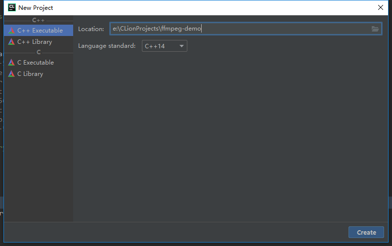
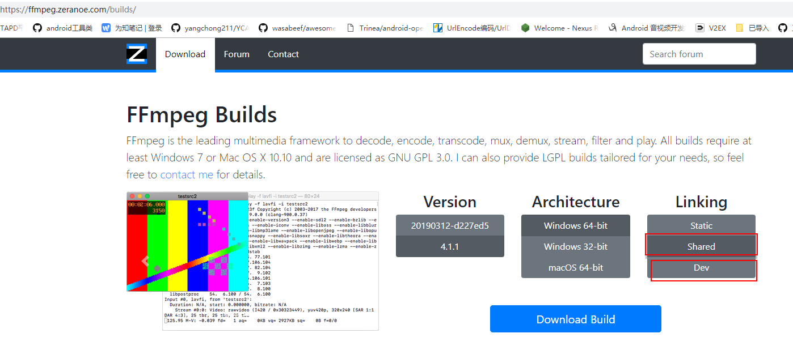
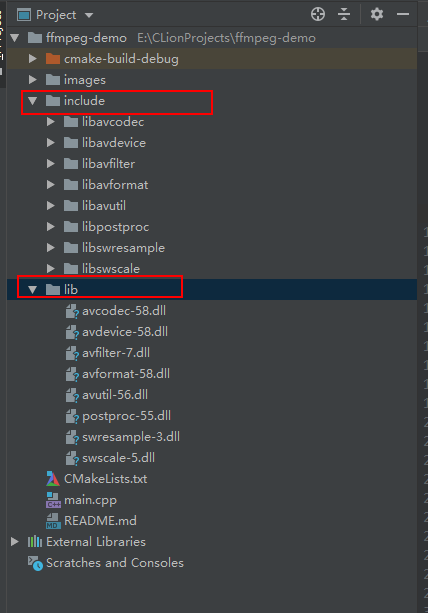
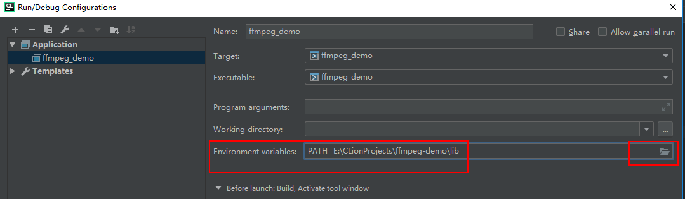
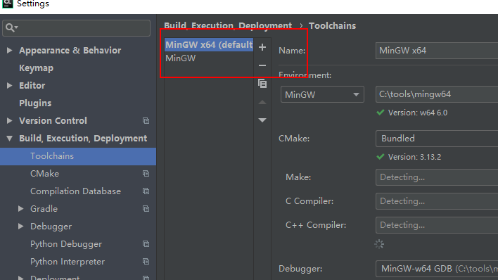

## 使用 CLion 导入已编译的 FFmpeg dll 步骤

### 准备环境
CLion2018.3 + MinGW x64

FFmpeg x64
http://ffmpeg.org/


### 开始
1. 创建 C++ 项目


2. 在 FFmpeg 官网下载已编译的 dll 和 头文件
（因本机环境为 x64，所以下载对应的 x64 shared 库文件）


3. 项目根目录创建目录 lib，将下载好的 `ffmpeg-4.1.1-win64-shared` 解压，拷贝出 bin 下的 8 个 dll 文件到该目录
4. 拷贝 `ffmpeg-4.1.1-win64-dev` 下 include 目录到项目根目录


5. 编辑 `CMakeLists.txt`
修改前
```
cmake_minimum_required(VERSION 3.13)
project(ffmpeg_demo)

set(CMAKE_CXX_STANDARD 14)

add_executable(ffmpeg_demo main.cpp)
```

修改后
```
cmake_minimum_required(VERSION 3.13)
project(ffmpeg_demo)

set(CMAKE_CXX_STANDARD 14)

# 添加头文件搜索路径
include_directories(include)
# 添加库文件搜索路径
link_directories(lib)

add_executable(ffmpeg_demo main.cpp)

target_link_libraries(ffmpeg_demo
        avcodec-58.dll
        avdevice-58.dll
        avfilter-7.dll
        avformat-58.dll
        avutil-56.dll
        postproc-55.dll
        swresample-3.dll
        swscale-5.dll
        )
```
其中target_link_libraries的位置要放在add_executable之后

target_link_libraries 中也可以不写 .dll，只写文件名

6. 编辑 main.cpp 代码
```cpp
#include <iostream>

extern "C"{
#include "libavformat/avformat.h"
#include "libavcodec/avcodec.h"
}

using namespace std;

int main() {
    std::cout << "Hello, World!" << std::endl;

    cout << avcodec_configuration() << endl;

    return 0;
}
```
因为 ffmpeg 代码是使用 c 编写的，所以引入到 cpp 项目时需要添加 extern "C"

7. 配置 lib 库依赖
Run -> Edit Configurations...


8. 确认使用工具链为 x64，因为下载的 ffmpeg 为 x64 的


将 x64 移动到第一个即默认使用这个

9. 运行 main 方法，打印出 ffmpeg 配置信息即为运行成功

## 错误
1. E:/CLionProjects/ffmpeg-demo/lib/avcodec-58.dll: file not recognized: File format not recognized
工具链环境与库文件环境不同，如工具链是 32 位，库文件使用的为 64 位，会识别不出来，统一环境即可

2. Process finished with exit code -1073741515 (0xC0000135)
没有将库文件添加到系统环境，参考步骤7


## 参考资料
* FFMPEG - (MAC) Clion project include ffmpeg libraries
https://blog.csdn.net/biezhihua/article/details/52734662


